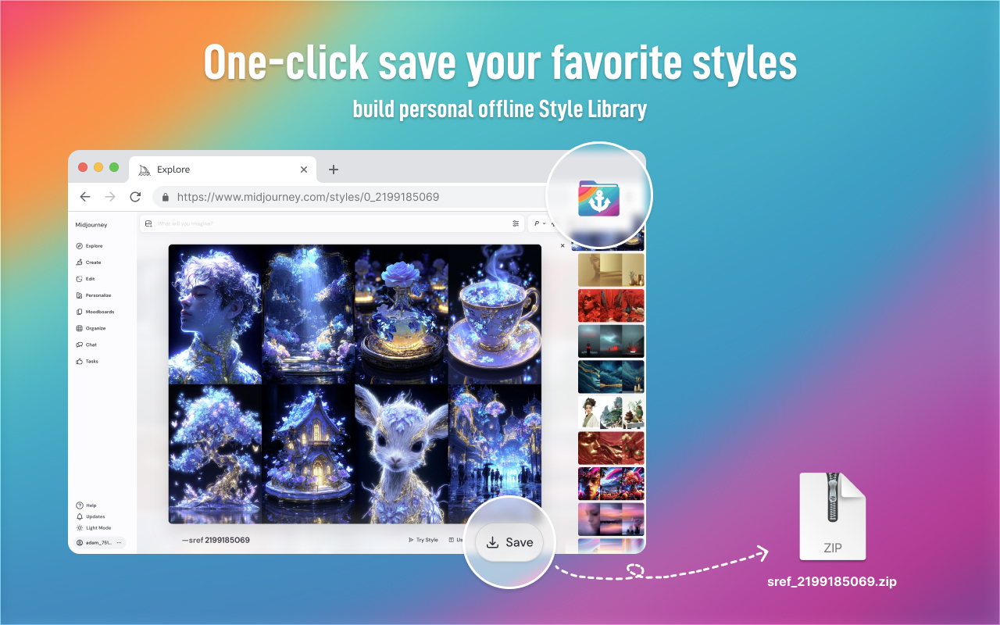
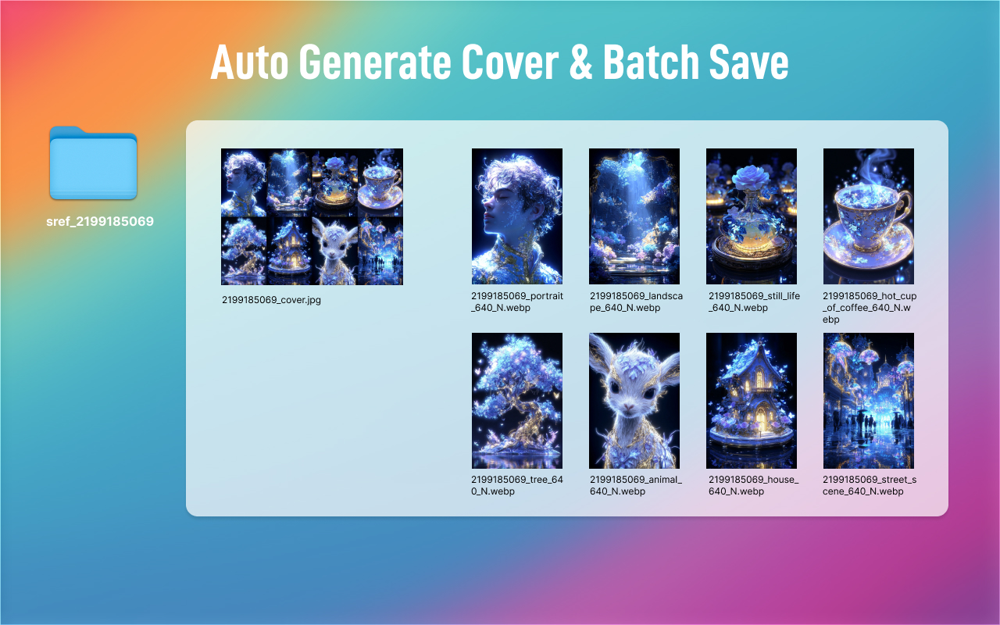

  <a href="README_zh.md">简体中文</a>

  

<h1 align="center">Midjourney Style Saver</h1>

  <strong>
    <a href="https://chromewebstore.google.com/detail/jbipmcbjahmcmdhoiljjimkdgfepplcm?utm_source=item-share-cb" target="_blank" rel="noopener">
     🎉 2025-10-29: Midjourney Style Saver is now live on the Chrome Web Store! You can add it directly from the Chrome Web Store.
    </a>
  </strong>

  
  

  <strong>One-click save your favorite styles, build your personal offline Style Library.</strong>

 

Midjourney Style Saver is a Chrome extension designed specifically for Midjourney users. It helps creators batch save all style example images while browsing the Style Explorer. The extension automatically downloads all 8 reference images for each style, generates a combined cover collage, and organizes files by style code for easy offline management and reference.

 

  

  

  

## ✨ Key Features

-   One-click batch download of all style images
-   Automatically generate an 8-image cover collage
-   Smart file naming by style code
-   Seamless integration with the Midjourney Style Explorer interface
-   Supports customizable image format (JPG/PNG)

## 🚀 Installation

1.  Download the latest release from GitHub.
2.  Open Chrome and navigate to `chrome://extensions/`.
3.  Enable **Developer mode**.
4.  Click **Load unpacked** and select the extracted folder of the extension.

## 📖 Usage

1.  Open Midjourney Style Explorer and select the Style tab.
2.  Click the newly added “Save” button in the toolbar at the bottom of the style popup.
3.  All 8 reference images and the generated cover will be downloaded as a ZIP file named `sref_{sref_code}.zip`.

## 🛠️ Development Information

-   **CODE Tool**: Google AI Studio
-   **CODE Model**: Gemini 2.5 PRO
-   **IMAGE**: Recraft.ai / Figma
-   **Other**: ChatGPT

## 📜 License

This project is licensed under the MIT License - see the [LICENSE](LICENSE.md) file for details.

## CONTACT
dongou1024@protonmail.com
