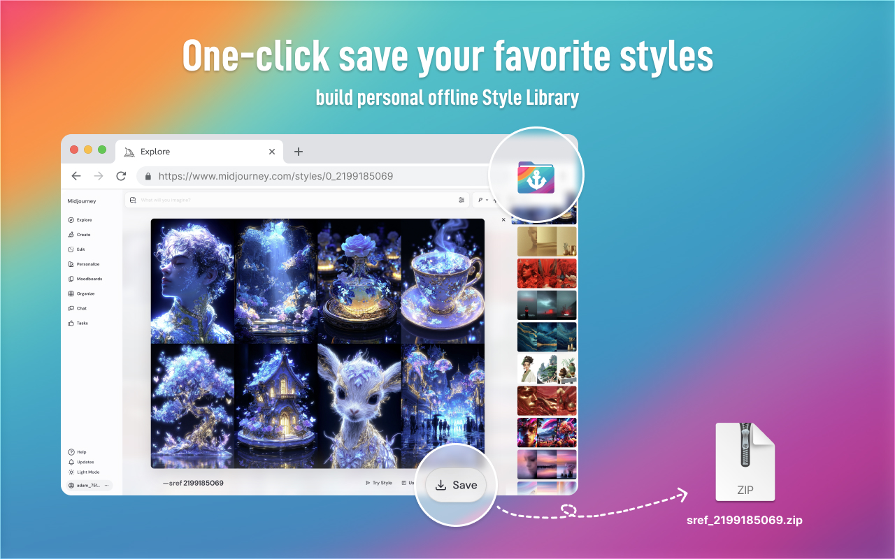
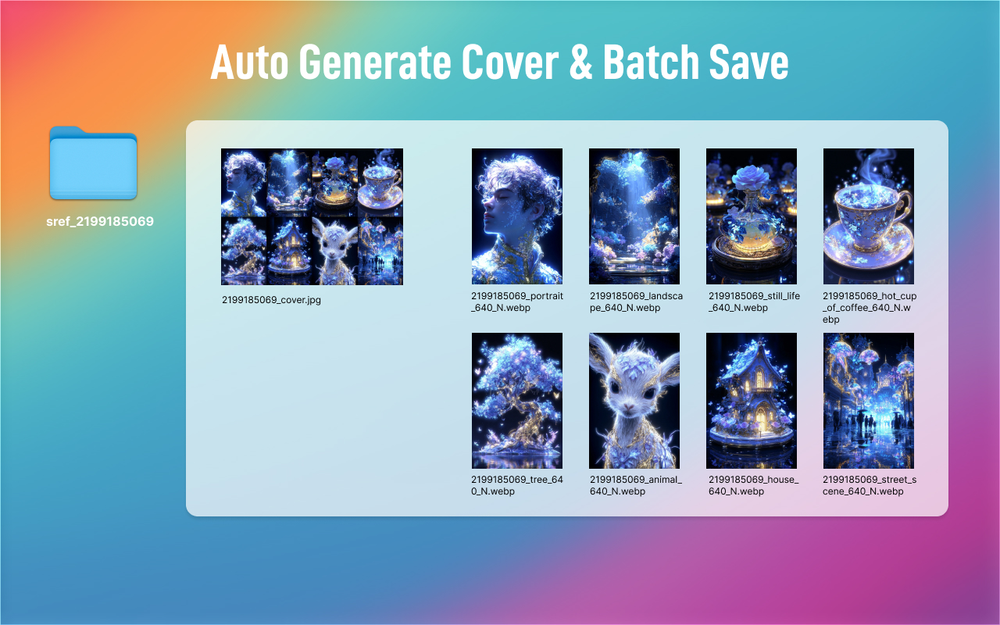
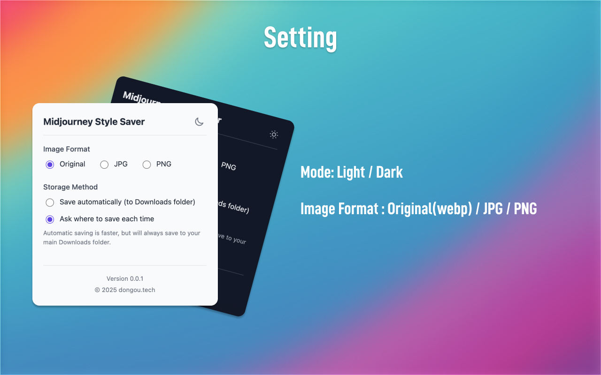

  <a href="README.md">English</a>

  

<h1 align="center">Midjourney Style Saver</h1>

  
  

  <strong>一键保存你心仪的风格，打造个人离线风格库。</strong>

 

Midjourney Style Saver 是一款专为 Midjourney 用户打造的 Chrome 浏览器扩展。它可以帮助创作者在浏览 Style Explorer 时，一键批量保存所有风格示例图片。插件会自动下载每个风格对应的 8 张示例图像，生成封面拼图，并根据风格代码自动分类保存，方便你离线整理与管理风格素材。

 

  

  

  

## ✨ 主要功能

-   一键批量保存所有风格示例图片
-   自动生成 8 张图拼接的封面预览图
-   按风格代码自动命名
-   无缝集成至 Midjourney Style Explorer 界面
-   支持自定义图片格式（JPG/PNG）

## 🚀 安装

1.  从 GitHub 下载最新发布的文件。
2.  打开 Chrome 并访问 `chrome://extensions/`。
3.  打开 **开发者模式**。
4.  点击 **加载已解压的扩展程序** 并选择解压后的文件夹。

## 📖 使用方法

1.  打开 Midjourney Style Explorer / 选择 Style 标签页。
2.  在风格弹窗底部工具栏，点击新增的 “保存” 按钮。
3.  所有 8 张示例图及生成的封面将作为 ZIP 文件下载，文件名为 `sref_{sref_code}.zip`。

## 🛠️ 开发信息

-   **CODE 工具**: Google AI Studio
-   **CODE 模型**: Gemini 2.5 PRO
-   **图片处理**: Recraft.ai / Figma
-   **其他**: ChatGPT

## 📜 License

本项目采用 MIT 授权许可 - 详情请参阅 [LICENSE](LICENSE.md) 文件。

## 练习方式
dongou1024@protonmail.com
